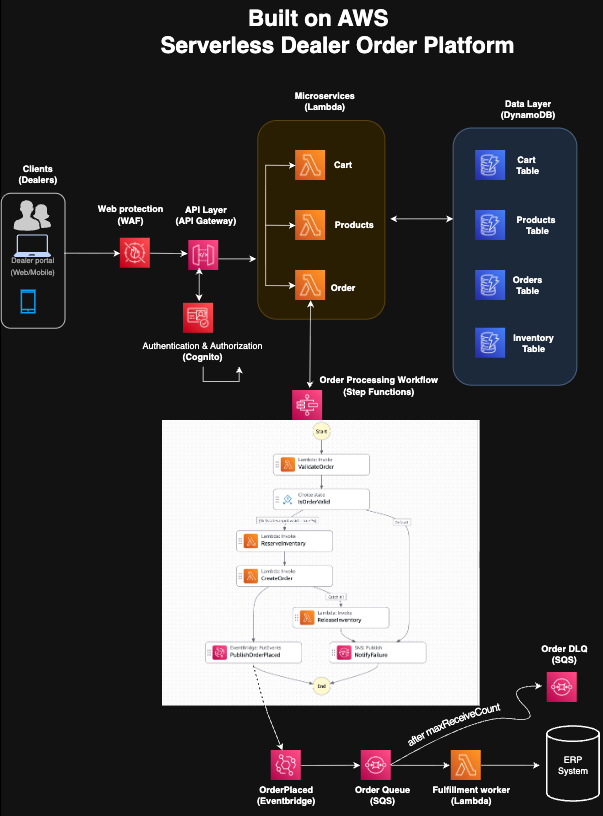

# Resilient Serverless Dealer Order Platform on AWS

A hands-on AWS architecture project built around a realistic business problem:

> How can multiple dealers place orders against limited inventory while keeping order processing resilient when downstream fulfillment is slow or temporarily unavailable?

The goal was not simply to connect AWS services, but to design for consistency, partial failure, asynchronous processing, recovery, security, observability, and repeatable deployment.

---

## Architecture



The solution combines three interaction patterns:

- **Synchronous APIs** for products, carts, and order submission
- **Workflow orchestration** for multi-step order processing
- **Asynchronous fulfillment** for downstream processing

---

## Business Flow

```text
Dealer / Client
      |
      v
AWS WAF
      |
      v
API Gateway
      |
      +------ Products Lambda ------> Products DynamoDB
      |
      +------ Cart Lambda ----------> Cart DynamoDB
      |
      +------ Orders Lambda
                  |
                  v
            Step Functions
                  |
             Validate Order
                  |
             Reserve Inventory
                  |
              Create Order
              /          \
         success          failure
            |                |
            v                v
       EventBridge      ReleaseInventory
            |                |
            v                v
           SQS              SNS
            |
            v
   Fulfillment Lambda
```

Amazon Cognito is used as the API authentication layer.

---

## Key Architecture Decisions

### Inventory consistency

Inventory reservation uses DynamoDB conditional updates.

The reservation succeeds only when the product exists and sufficient inventory is available. This avoids a read-then-write race condition where concurrent orders could otherwise reserve the same stock.

### Saga-style compensation

Inventory reservation and order creation are separate distributed operations.

If inventory is reserved successfully but order creation fails, Step Functions catches the failure and invokes `ReleaseInventory` to restore the reserved quantity.

```text
ReserveInventory  -> success
CreateOrder       -> failure
ReleaseInventory  -> compensation
```

The failed order is not published as an `OrderPlaced` event.

### Decoupled fulfillment

Order creation should not depend on the availability or response time of downstream fulfillment systems.

After successful order creation:

```text
CreateOrder
   |
   v
EventBridge
   |
   v
SQS
   |
   v
Fulfillment Lambda
```

EventBridge decouples the producer from downstream consumers, while SQS provides durable buffering and retry capability.

---

## Failure Handling

| Failure | Handling |
|---|---|
| Invalid order | Step Functions failure path / SNS |
| Insufficient inventory | DynamoDB conditional update rejects reservation |
| Order creation fails after reservation | Saga compensation restores inventory |
| Fulfillment temporarily unavailable | Message remains buffered in SQS |
| Repeated consumer failure | DLQ pattern |
| Infrastructure deployment failure | CloudFormation rollback |

---

## Security

The architecture separates identity and traffic protection:

- **Amazon Cognito** for API authentication / authorization
- **AWS WAF** for application-layer traffic filtering
- **API Gateway** as the API boundary and routing layer

IAM permissions are separated across Lambda functions, Step Functions, CodeBuild, CodePipeline, and CloudFormation execution roles.

---

## Infrastructure as Code

The application is defined using AWS SAM / CloudFormation.

The stack includes:

- API Gateway
- Lambda
- DynamoDB
- Step Functions
- EventBridge
- SQS + DLQ
- SNS
- Cognito
- WAF
- IAM
- CloudWatch / X-Ray configuration

Using infrastructure as code makes the environment reproducible instead of depending on manually configured console resources.

---

## CI/CD

Deployment is automated from GitHub:

```text
GitHub
   |
   v
AWS CodePipeline
   |
   v
AWS CodeBuild
   |
   | sam validate
   | sam build
   | sam package
   v
packaged.yaml
   |
   v
AWS CloudFormation
   |
   v
Application Stack
```

CodePipeline orchestrates the workflow.

CodeBuild validates, builds, and packages the SAM application.

CloudFormation performs the actual infrastructure update.

---

## Debugging Lessons

A large part of the project value came from troubleshooting integration boundaries rather than implementing individual AWS services.

Examples included:

- Incorrect DynamoDB resource ARNs
- Lambda code edited but not deployed
- Incorrect Step Functions ARN configuration
- Step Functions Lambda payload-wrapper issues
- EventBridge rule attached to the wrong event bus
- SQS messages consumed before manual inspection
- Lambda environment-variable / resource identity mismatches
- `iam:PassRole` failures
- CodePipeline vs SAM S3 artifact confusion
- CodeBuild buildspec configuration
- SAM packaging failures
- CloudFormation capability requirements
- CloudFormation execution-role permissions
- CloudFormation rollback and recovery behavior

The recurring lesson was:

> The difficult part of distributed cloud architecture is often not the individual service, but the contract, permission, state transition, and failure behavior between services.

---

## Repository Structure

```text
.
├── template.yaml
├── samconfig.toml
├── buildspec.yml
├── statemachine/
│   └── order-workflow.asl.yaml
└── src/
    ├── products/
    ├── cart/
    ├── orders/
    ├── validate_order/
    ├── reserve_inventory/
    ├── create_order/
    ├── release_inventory/
    └── fulfillment/
```

---

## Deploy

```bash
sam validate --lint
sam build
sam deploy --guided
```

Recommended first deployment settings:

- Stack name: `dealer-platform-samv2-dev`
- Region: `eu-central-1`
- Allow SAM / CloudFormation to create IAM roles
- Leave `FailureEmail` blank unless an SNS email subscription is required

---

## Seed Test Data

Add one product to the Products table:

```text
product_id = CAR-001
name       = Model A
price      = 42000
inventory  = 10
```

---

## Acceptance Path

1. Create or use a Cognito test user
2. Verify API authorization
3. `GET /products`
4. `POST /orders` with an `Idempotency-Key`
5. Verify Step Functions execution
6. Verify inventory reservation and order persistence
7. Verify EventBridge -> SQS -> Fulfillment
8. Run a controlled order-creation failure to verify Saga compensation

---

## Production Hardening

Potential next steps include:

- Stronger persistent idempotency
- Transaction-safe handling for multi-item inventory reservations
- Stricter least-privilege deployment roles
- CloudWatch alarms and operational runbooks
- Automated integration tests
- Canary / linear Lambda deployments

---

## Cost and Cleanup

AWS WAF and other deployed resources may incur charges while provisioned.

Remove the SAM-created stack when it is no longer required:

```bash
sam delete \
  --stack-name dealer-platform-samv2-dev \
  --region eu-central-1
```

CI/CD resources and artifact buckets should also be removed if they are no longer needed.

Keep the GitHub repository, architecture diagram, and screenshots as portfolio evidence.
